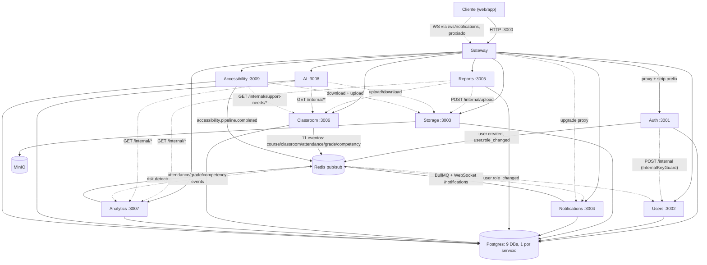
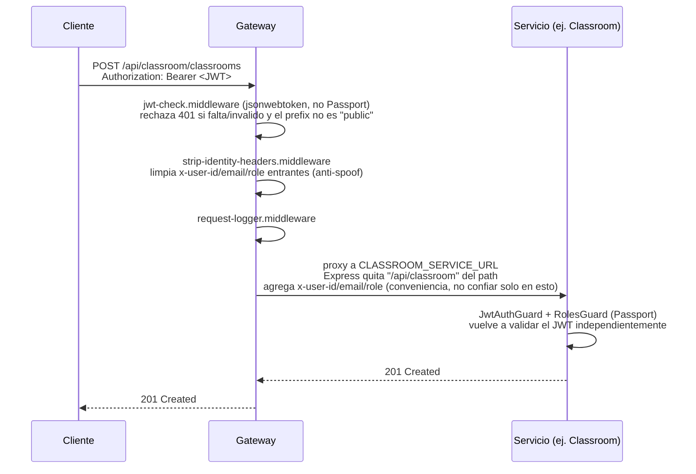

# Arquitectura

Monorepo de 10 microservicios NestJS (`apps/*`, workspaces pnpm manuales, sin Nx) más un paquete compartido `@minedu/common` (`packages/common`). Cada servicio es un proyecto NestJS independiente con su propio `package.json`, y los que tienen base de datos usan Prisma con `output = "../generated/prisma"` para no pisarse el cliente generado entre sí.

## Topología

Puntos clave de esta topología:

- **El Gateway es el único punto de entrada HTTP y WebSocket público.** El WS de Notifications ya no se conecta directo: el cliente hace `io('http://<gateway>:3000/notifications', { path: '/ws/notifications', auth: { token } })` y el Gateway proxya el `upgrade` hacia Notifications (`http-proxy-middleware`, `ws: true`, enganchado al evento `upgrade` del `http.Server` en `apps/gateway/src/main.ts`). El puerto `3004` de Notifications ya no está publicado en `docker-compose.yml`.
- **Las llamadas `internal/*` (líneas punteadas) van servicio-a-servicio, sin pasar por el Gateway**, autenticadas con el header `x-internal-key` (`InternalKeyGuard` de `@minedu/common`), nunca con JWT de usuario.
- **Cada servicio con base de datos tiene su propia DB Postgres** (`<servicio>_db`), nunca comparten esquema. No hay una DB "central" ni foreign keys entre servicios — la unica forma de referenciar datos de otro servicio es por HTTP interno o por eventos.
- **AI y Reports son los únicos servicios "agregadores"**: no tienen su propio dominio de datos operacional, sino que combinan datos de Classroom + Analytics (+ Storage para persistir el resultado). Ver la distinción entre ambos en [SERVICES.md](./SERVICES.md#ai-vs-reports).

## Flujo de una request típica (con auth)

**Defensa en profundidad**: el JWT se valida dos veces — una vez en el Gateway (rechazo temprano, `jsonwebtoken` puro) y otra vez en cada servicio (`JwtStrategy`/`JwtAuthGuard` de `@minedu/common`, vía Passport). Ningún servicio confía en que "ya pasó por el Gateway".

Solo el prefix `auth` está marcado `public: true` en `apps/gateway/src/config/services.config.ts` — todo lo demás exige JWT válido en el Gateway antes de reenviar la request.

## Convención de prefijos de controlador

Express, dentro del middleware de proxy del Gateway, **quita el prefijo del servicio** (`/api/<servicio>`) del `req.url` antes de reenviar. Por eso:

- Los controladores "raíz" de un servicio usan `@Controller()` vacío (ej. `AuthController`, `UsersController`, `AccessibilityController`).
- Los controladores de **sub-recursos dentro del mismo servicio** sí pueden llevar prefijo, siempre que ese prefijo sea distinto al nombre del propio servicio: `CourseController` (`@Controller('courses')`) y `ClassroomController` (`@Controller('classrooms')`) conviven dentro del servicio `classroom` sin problema, porque después de que el Gateway quita `/api/classroom` queda `/courses` o `/classrooms`.
- **Error clásico** (ocurrió una vez durante el desarrollo de Reports): si un controlador repite el nombre del propio servicio como prefijo — `@Controller('reports')` dentro del servicio `reports` — el Gateway deja el path en `/generate` pero el controlador espera `/reports/generate`, y todo responde 404. La regla simple: el prefijo del controlador nunca debe ser igual al `prefix` de ese servicio en `services.config.ts`.

## Autenticación y autorización

- **JWT** firmado por Auth (`JWT_SECRET` compartido por env entre todos los servicios). Payload: `{ sub, email, role, iat }` (`JwtPayload` en `@minedu/common`).
- **Roles** (`Role` enum en `@minedu/common`): `ADMIN`, `DIRECTIVO`, `DOCENTE`, `ESPECIALISTA`, `ESTUDIANTE`. Cada endpoint declara `@Roles(...)` + `RolesGuard`.
- **Auth no guarda el perfil completo del usuario** — solo `AuthUser` (email, passwordHash, role). Al registrar, llama internamente a Users (`POST /internal`) para crear el perfil (`fullName`, etc.) y publica `user.created` para que Notifications reaccione. Es decir, **el `id` de `AuthUser` (== `sub` del JWT) es el mismo `authUserId` que usa Users como clave foránea lógica** — no hay un solo "User" compartido, hay dos tablas en dos DBs distintas enlazadas por ese id.
- **Cambiar el rol de un usuario** es exclusivo de Auth (`PATCH /api/auth/:authUserId/role`, `ADMIN`) — es la única fuente que se firma en el JWT. Publica `user.role_changed` (Users sincroniza su copia) y escribe `auth:role-version:<authUserId>` en Redis para invalidar JWTs viejos: `JwtStrategy.validate()` compara el `iat` del token contra esa marca en **todo** servicio con `JwtAuthGuard`, no solo en el Gateway — mismo criterio de defensa en profundidad que el resto de la validación de JWT. Fail-open si Redis no responde (se loguea, no se bloquea la request). Detalle completo en [SERVICES.md](./SERVICES.md#invalidación-de-sesión-por-cambio-de-rol).
- **Llamadas internas** (`x-internal-key` == `INTERNAL_API_KEY`) no llevan JWT de usuario — son confianza de red interna, no de identidad.

## Eventos (Redis Pub/Sub) vs. llamadas HTTP internas — cuándo se usa cada uno

- **Eventos** (`RedisPubSubService` + catálogo `EVENTS` en `@minedu/common`) se usan para **reacciones asíncronas desacopladas**: Classroom no sabe ni le importa que Analytics recalcula indicadores cuando se registra una asistencia o competencia; solo publica `attendance.registered` o `competency.evaluated`. Ver el mapa completo de eventos en [SERVICES.md](./SERVICES.md#catálogo-de-eventos).
- **Llamadas HTTP internas** (`/internal/*` + `InternalKeyGuard`) se usan cuando un servicio **necesita el dato ya, de forma síncrona**, para construir una respuesta (ej. Reports necesita leer clasrooms+attendances+grades+risk *en el momento* de generar un reporte — no puede esperar a que le lleguen por evento).

## Despliegue Docker

Cada servicio tiene un `Dockerfile` multi-stage (`build` compila con `pnpm`+`nest build`+`prisma generate`, `runtime` copia el `/repo` completo del stage de build — no se usa `pnpm deploy --prod` porque rompe symlinks de pnpm entre stages).

**Lecciones aprendidas del primer despliegue completo en un VPS Ubuntu 20.04** (2026-07-25, ver commit `39847b2`) — antes de esto nunca se había corrido el stack de 10 imágenes de punta a punta:

1. **`packageManager` fijado en el root `package.json`** (`pnpm@10.22.0`). Sin esto, Corepack resuelve "la última" pnpm en cada build, y pnpm 11+ bloquea scripts de postinstall por defecto (`ERR_PNPM_IGNORED_BUILDS`), rompiendo el build de los 10 servicios en cualquier máquina que no tenga ya cacheada la misma versión que el autor original.
2. **`RUN apk add --no-cache openssl`** agregado a los 9 Dockerfiles que usan Prisma, en ambos stages. `node:22-alpine` no trae `libssl` instalado; sin él, Prisma no puede detectar la versión de OpenSSL al generar el query engine y cae a un binario (`openssl-1.1.x`) que no existe en el sistema — el servicio compila bien pero **crashea al conectar a la base de datos en runtime**. Este bug afectaba a los 9 servicios con DB, no solo a los nuevos.
3. **El `Dockerfile` de Gateway no copiaba `packages/common`** pese a depender de `@minedu/common` — build roto. Los demás servicios sí lo hacían bien (`COPY packages ./packages` o `COPY packages/common ./packages/common`).
4. Si agregas un servicio o Dockerfile nuevo, **verifica que build igual en un entorno limpio** (`docker compose build <servicio>` desde cero, no solo `pnpm dev:<servicio>` local) — varios de estos bugs solo se manifiestan en un contenedor real, nunca en desarrollo local porque pnpm enlaza los workspaces por symlink.

Con 10 servicios + Postgres + Redis + MinIO, **un VPS con menos de 2GB de RAM necesita swap** (se usó un swapfile de 4GB) para que `docker compose build` no falle por OOM al compilar TypeScript de varios servicios.

## Variables de entorno

Cada servicio valida su entorno con Joi en `src/config/env.validation.ts` (`ConfigModule.forRoot({ isGlobal: true, validationSchema })`). Variables compartidas vía `.env` en la raíz (usadas por `docker-compose.yml` con `${VAR:-default}`):

| Variable | Usada por | Default de compose |
|---|---|---|
| `POSTGRES_USER` / `POSTGRES_PASSWORD` | postgres + todos los servicios con DB | `minedu` / `minedu` |
| `JWT_SECRET` | todos (Gateway valida, cada servicio revalida) | `dev-secret-change-me` |
| `JWT_EXPIRES_IN` | auth | `86400` |
| `INTERNAL_API_KEY` | todas las llamadas `/internal/*` | `dev-internal-key` |
| `RATE_LIMIT_MAX` | gateway | `100` |
| `MINIO_ROOT_USER` / `MINIO_ROOT_PASSWORD` / `MINIO_BUCKET` | storage, minio | `minedu` / `minedu123` / `minedu-files` |
| `GROQ_API_KEY` | accessibility, para adaptación de texto (requerido, sin default) | — debe proveerse, si no el servicio no arranca (Joi `required()`). |
| `ELEVENLABS_API_KEY` | accessibility, para texto-a-voz (requerido, sin default) | — debe proveerse, si no el servicio no arranca (Joi `required()`). |
| `ELEVENLABS_VOICE_ID` | accessibility, voz usada por ElevenLabs | `JBFqnCBsd6RMkjVDRZzb` |

Cada servicio también recibe sus propias `*_SERVICE_INTERNAL_URL` (apuntando al hostname Docker del servicio del que depende) — ver el detalle por servicio en [SERVICES.md](./SERVICES.md).
