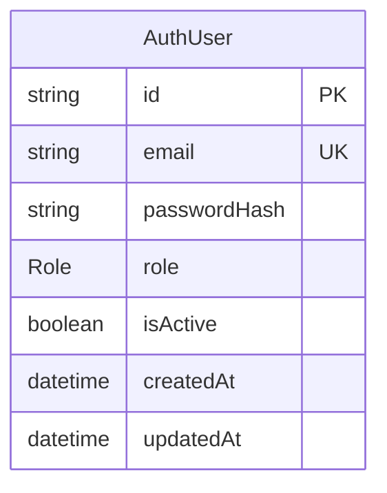
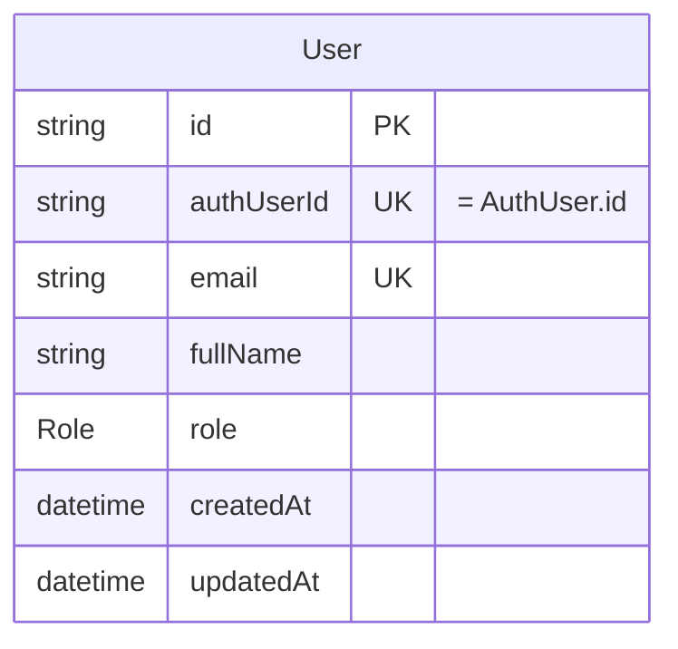
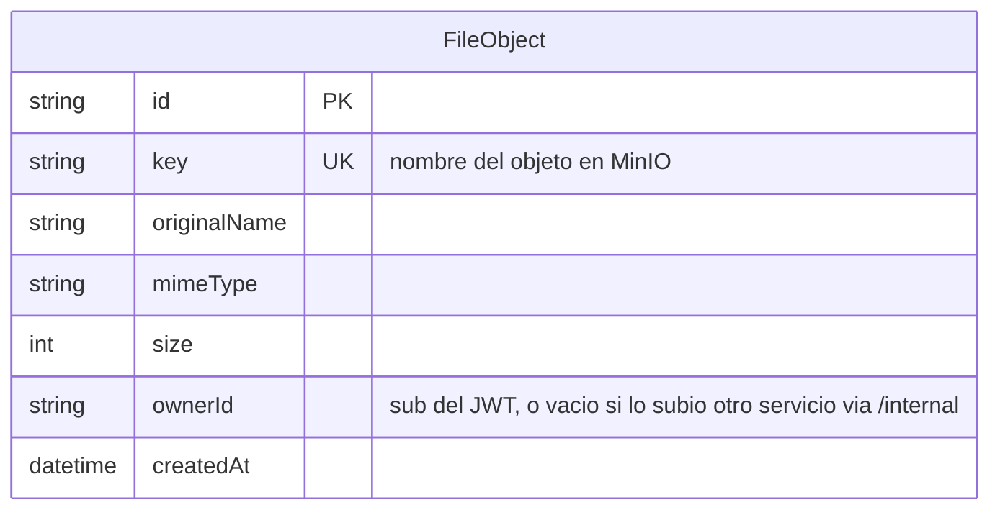
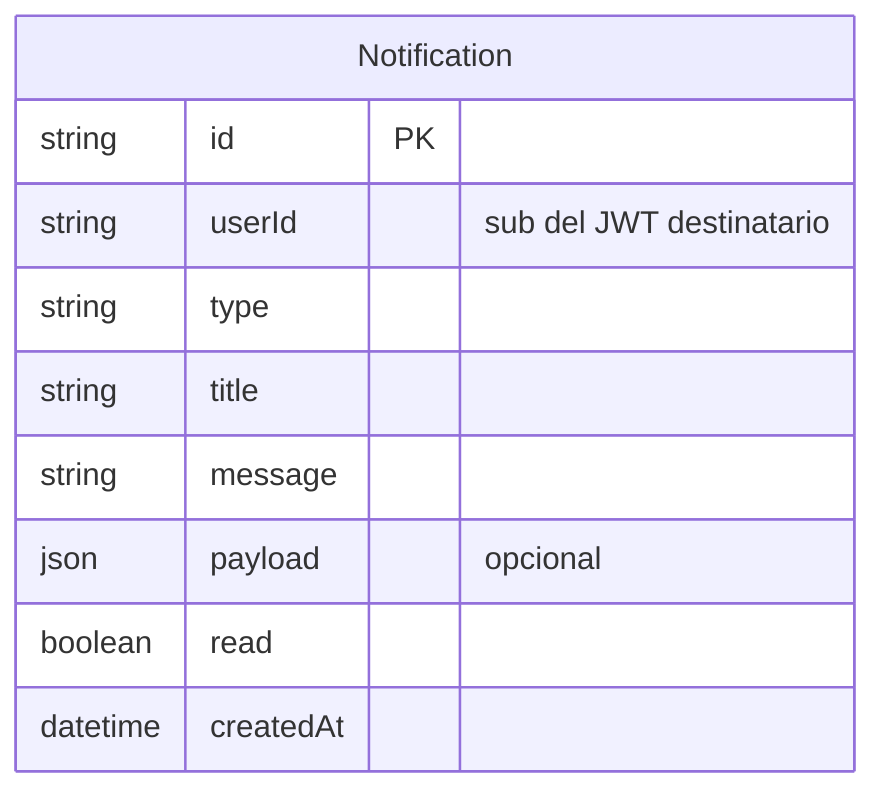
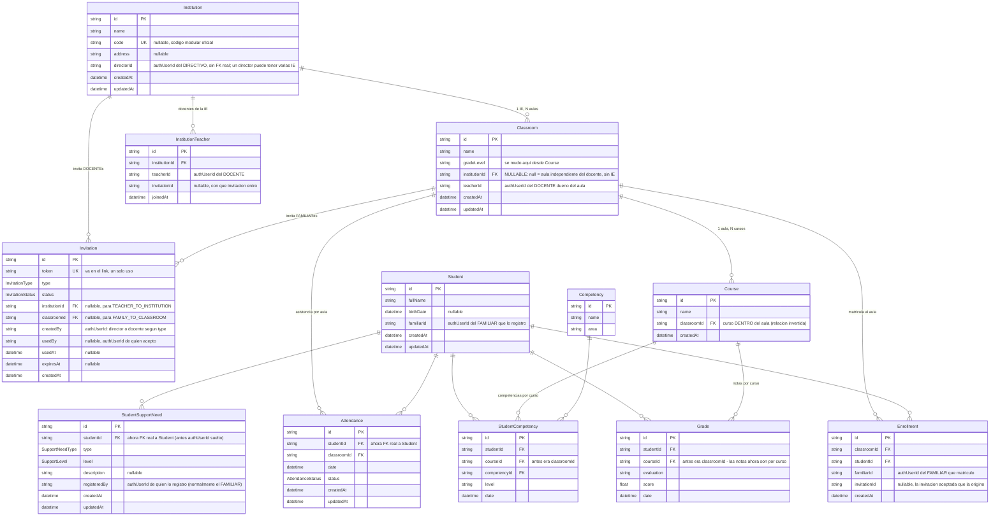
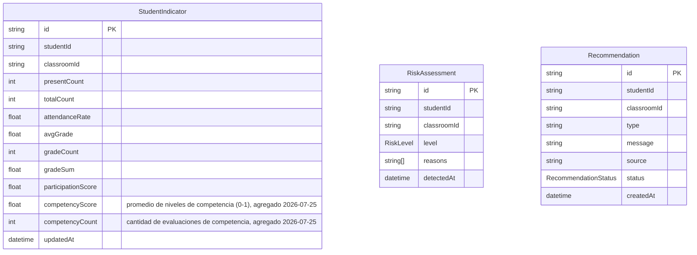
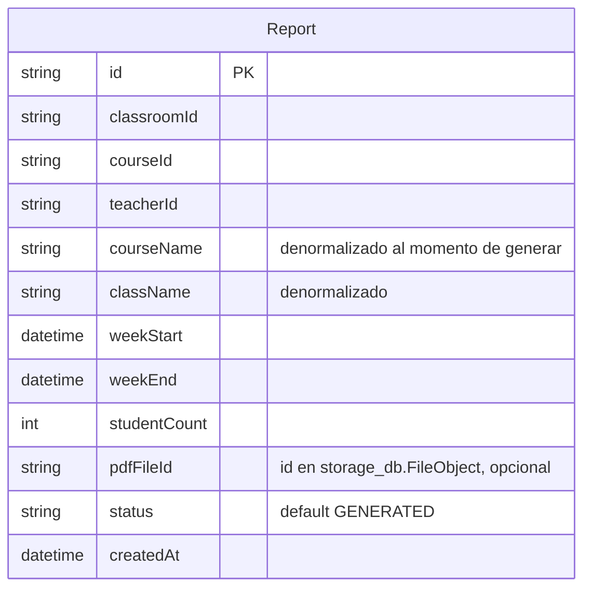
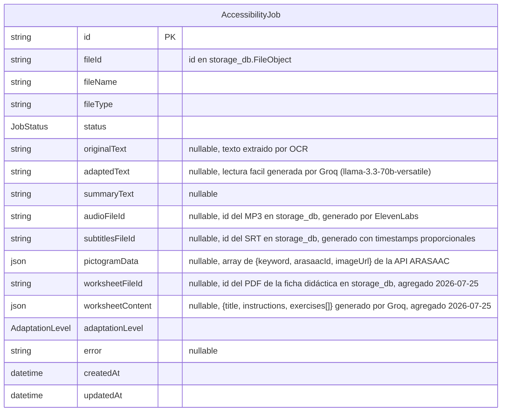
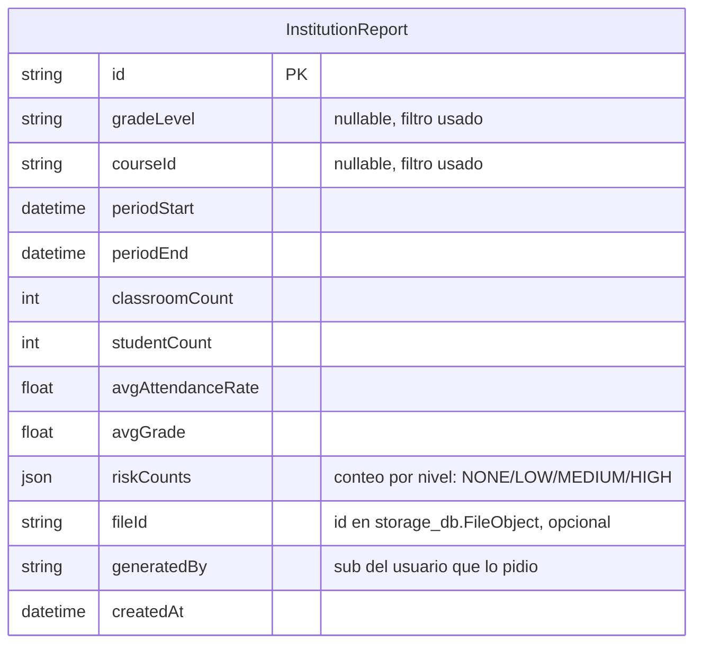

# Bases de datos

Un Postgres compartido (`docker-compose.yml`, contenedor `postgres`) con **9 bases de datos separadas**, una por servicio (creadas por `docker/postgres/init-multiple-dbs.sh` a partir de `POSTGRES_MULTIPLE_DATABASES`). Gateway no tiene DB. **No hay foreign keys entre bases** — cualquier referencia a datos de otro servicio (ej. `authUserId`, `classroomId`, `teacherId`) es un string suelto, sin integridad referencial a nivel de Postgres; la consistencia se mantiene por convención de la aplicación (HTTP interno / eventos).

Todos los `schema.prisma` declaran `output = "../generated/prisma"` (carpeta gitignored, se regenera con `pnpm --filter <servicio> exec prisma generate`) y el cliente se importa por ruta relativa (`../../generated/prisma`), nunca desde `@prisma/client`.

## `auth_db` — Auth

`Role` = `ADMIN | DIRECTIVO | DOCENTE | FAMILIAR` (mismo enum duplicado en cada schema que lo necesita — Prisma no comparte enums entre datasources). **Remodelado 2026-07-25**: desaparecieron `ESPECIALISTA` y `ESTUDIANTE` — el estudiante ya no es usuario (es un registro `Student` en `classroom_db`, creado por su `FAMILIAR`); la migración mapeó los usuarios existentes (`ESTUDIANTE→FAMILIAR`, `ESPECIALISTA→DOCENTE`) en vez de borrarlos.

Solo credenciales. `AuthUser.id` es el mismo valor que `sub` en el JWT y que `User.authUserId` en `users_db`.

## `users_db` — Users

Perfil separado de las credenciales. `role` está duplicado aquí respecto a `auth_db` (por diseño, para no depender de una llamada síncrona a Auth en cada lectura) — se mantiene sincronizado vía el evento `user.role_changed` que publica Auth al cambiar el rol (`PATCH /api/auth/:authUserId/role`), consumido por `apps/users/src/events/events-subscriber.service.ts`. Ver [SERVICES.md](./SERVICES.md#invalidación-de-sesión-por-cambio-de-rol) para el mecanismo completo, incluida la invalidación de JWTs viejos.

## `storage_db` — Storage

## `notifications_db` — Notifications

## `classroom_db` — Classroom (11 modelos, el esquema más grande)

**Remodelado completo 2026-07-25** (solo a nivel de BD — la adaptación del código de aplicación está pendiente, ver [PENDING.md](./PENDING.md)). Jerarquía nueva: **Institution (IE, del DIRECTIVO) → Classroom (aula, del DOCENTE) → Course (curso)** — se invirtió la relación anterior (antes `Course → Classrooms`). El estudiante dejó de ser usuario: es un registro `Student` creado por su `FAMILIAR`, y la matrícula es la tabla `Enrollment` (al aula, vía invitación por link).

Notas de diseño:

- **Flujo de invitaciones (un solo uso)**: el DIRECTIVO crea la `Institution` y genera `Invitation` de tipo `TEACHER_TO_INSTITUTION` (el DOCENTE que la acepta queda en `InstitutionTeacher`). El DOCENTE crea aulas en la IE y genera `Invitation` de tipo `FAMILY_TO_CLASSROOM`; el FAMILIAR que la acepta adjunta **1 hijo (`Student`) por invitación**, lo que crea el `Enrollment`. `InvitationType` = `TEACHER_TO_INSTITUTION | FAMILY_TO_CLASSROOM`; `InvitationStatus` = `PENDING | ACCEPTED | REVOKED | EXPIRED`; `token` (`@unique`) es lo que viaja en el link.
- **`Student` no es usuario**: no tiene fila en `auth_db`/`users_db` ni puede loguear. `familiarId` es el `authUserId` del FAMILIAR responsable. Todas las tablas que antes guardaban `studentId = authUserId` ahora referencian `Student.id` **con FK real** (misma DB) — esto incluye `Attendance`, `Grade`, `StudentCompetency`, `StudentSupportNeed` y `Enrollment`.
- **Aulas independientes e importación a la IE**: `Classroom.institutionId` es nullable — un DOCENTE puede crear aulas por su cuenta sin pertenecer a ninguna IE (`institutionId = null`). Al aceptar una invitación `TEACHER_TO_INSTITUTION`, sus aulas independientes se **importan** a esa institución (se les asigna el `institutionId`). El FK es `onDelete: SetNull`: si el director borra la IE, las aulas no se destruyen — vuelven a ser independientes del docente (el aula pertenece al docente; la IE es una afiliación).
- **Matrícula = `Enrollment` al aula** (`@@unique([classroomId, studentId])`), reemplaza el array `Classroom.studentIds`. Ahora sí hay fecha de ingreso y trazabilidad de qué invitación la originó.
- **Asistencia por aula, notas y competencias por curso** (decisión de diseño): `Attendance.classroomId` (se asiste al aula), `Grade.courseId` y `StudentCompetency.courseId` (se califica por curso). `AttendanceStatus` = `PRESENT | ABSENT | LATE | EXCUSED`, `@@unique([studentId, classroomId, date])` se mantiene.
- Cascadas: borrar una `Institution` **no** borra sus aulas (quedan independientes por el `SetNull` de arriba), pero sí borra sus `InstitutionTeacher` e invitaciones; borrar un aula borra sus cursos/matrículas/asistencias; borrar un `Student` borra sus matrículas, asistencias, notas, competencias y necesidades de apoyo.
- **`StudentSupportNeed`** (desafío de Educación Básica Especial, Categoría A — ver `docs/hackathon-bases-2026.pdf`): mismos enums de antes (`SupportNeedType` con 9 valores, `SupportLevel = LEVE | MODERADO | SIGNIFICATIVO`, mismo vocabulario que `AdaptationLevel` en `accessibility_db`), pero ahora cuelga de `Student` con FK real y lo registra normalmente el FAMILIAR al crear a su hijo. Una fila por necesidad (un estudiante puede tener varias). Consumido por Accessibility vía `GET /internal/support-needs/student/:studentId` (el id ahora es `Student.id`).
- La migración `20260725170002_institutions_and_families` fue **destructiva** (dropeó y recreó todo el dominio — data de prueba de hackathon, aprobado).

## `analytics_db` — Analytics (3 modelos)

`StudentIndicator` tiene `@@unique([studentId, classroomId])` — es un **acumulador que se actualiza in-place** cada vez que llega un evento de asistencia, nota o competencia (no una serie histórica; `gradeSum`/`gradeCount` existen justamente para poder recalcular el promedio incrementalmente sin releer todas las notas). `competencyScore` es el promedio de los niveles de competencia evaluados (mapeados: `BASICO=0.25`, `INTERMEDIO=0.5`, `AVANZADO=0.75`, `LOGRADO=1.0`). `RiskLevel` = `NONE | LOW | MEDIUM | HIGH`. `RecommendationStatus` = `PENDING | SENT | DISMISSED`.

Ninguno de los tres modelos tiene relación Prisma declarada hacia Classroom (no puede — es otra base de datos); `studentId`/`classroomId` son strings sueltos que solo tienen sentido cruzados con `classroom_db` a nivel de aplicación. **Ojo (remodelado 2026-07-25)**: `studentId` aquí ahora significa `Student.id` de `classroom_db` (antes era el `authUserId` del estudiante-usuario, que ya no existe) — el schema no cambió pero la semántica sí; los datos viejos quedaron huérfanos con el reset del dominio de Classroom. Además `Grade` ahora es por curso, así que los eventos de nota que consume Analytics necesitan resolver `courseId → classroomId` (pendiente de adaptación, ver [PENDING.md](./PENDING.md)).

## `ai_db` — AI

Reporte semanal **de una sola aula**. Los campos `courseName`/`className` están desnormalizados a propósito (copiados de Classroom al momento de generar) para que el reporte no cambie retroactivamente si el nombre del curso/aula cambia después.

## `accessibility_db` — Accessibility

`JobStatus` = `PENDING | PROCESSING | COMPLETED | FAILED`. `AdaptationLevel` = `LEVE | MODERADO | SIGNIFICATIVO`. Los campos de salida del pipeline base (`audioFileId`, `subtitlesFileId`, `pictogramData`) se poblan al completar `POST /process`: el audio (MP3, generado por ElevenLabs) se sube a Storage vía `POST /internal/upload` (base64 JSON), el SRT se genera con `srt.util.ts` (timestamps proporcionales basados en una duración estimada por velocidad de habla, no en el audio en sí — parsear duración real de un MP3 requeriría decodificar frames, no solo leer un header como en WAV), y los pictogramas se obtienen de la API pública de ARASAAC (hasta 10 keywords más frecuentes del texto adaptado, excluyendo stop words en español).

`worksheetFileId`/`worksheetContent` se poblan solo si se llama `POST /process/worksheet` (agregado 2026-07-25) — reusa el `adaptedText` y los `pictogramData` ya calculados por el pipeline base, le pide a Groq reestructurarlos como ficha (título + instrucciones + 3-5 ejercicios), opcionalmente personalizada contra `StudentSupportNeed` de `classroom_db` (vía HTTP interno, si se pasa `studentId` — que tras el remodelado 2026-07-25 es `Student.id`, no un authUserId), y arma un PDF con `pdfkit` que se sube a Storage. Ver [SERVICES.md](./SERVICES.md#accessibility--puerto-3009-db-accessibility_db).

## `reports_db` — Reports

Reporte agregado **multi-aula**. No hay un modelo `scope`/enum explícito: si `gradeLevel` y `courseId` son ambos `null`, el reporte es institucional completo; si alguno está seteado, fue filtrado por ese criterio. `riskCounts` es la única columna `Json`/`JSONB` de todo el sistema (el resto de conteos agregados son columnas numéricas planas).

## Resumen: qué servicio es dueño de qué dato

| Dato | Dueño (fuente de verdad) | Quién más lo lee/copia |
|---|---|---|
| Credenciales (email, password) | Auth | — |
| Perfil (nombre, rol) | Users | Auth guarda una copia de `role` al registrar |
| Archivos binarios | Storage | AI, Reports, Accessibility (suben/leen vía interno) |
| Notificaciones | Notifications | — |
| Instituciones educativas, docentes por IE, invitaciones | Classroom | — |
| Estudiantes (registro `Student`, ya no son usuarios) y sus necesidades de apoyo | Classroom | Accessibility (vía HTTP interno, solo lectura) |
| Aulas, cursos, matrícula (`Enrollment`), asistencia, notas, competencias | Classroom | Analytics (vía eventos), AI y Reports (vía HTTP interno, solo lectura) |
| Indicadores, riesgo, recomendaciones | Analytics | AI y Reports (vía HTTP interno, solo lectura) |
| Reportes PDF por aula | AI | — |
| Reportes CSV institucionales | Reports | — |
| Jobs de accesibilidad | Accessibility | — |

Ningún servicio escribe en la base de datos de otro directamente — toda escritura cruzada pasa por un endpoint HTTP (`/internal/*` o público) del servicio dueño.
