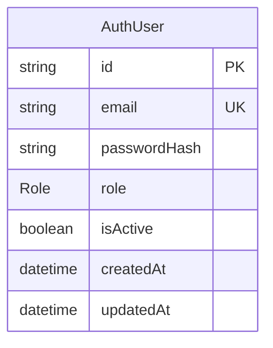
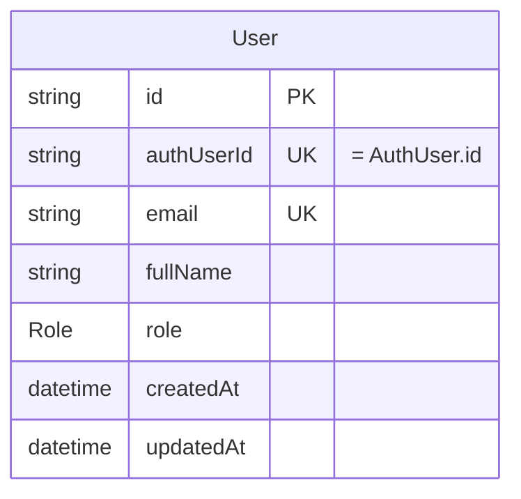
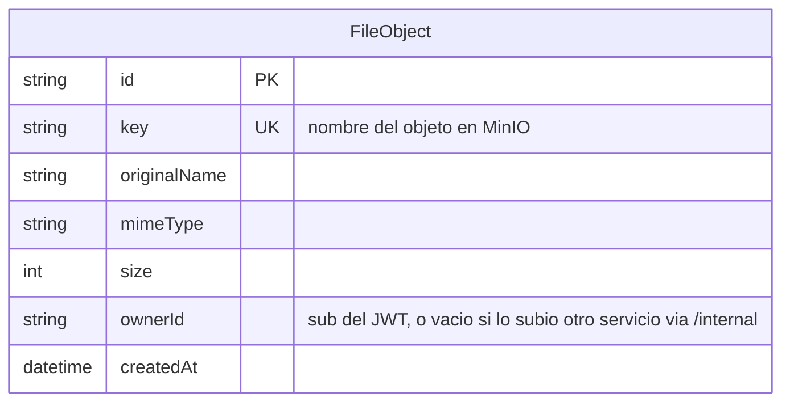
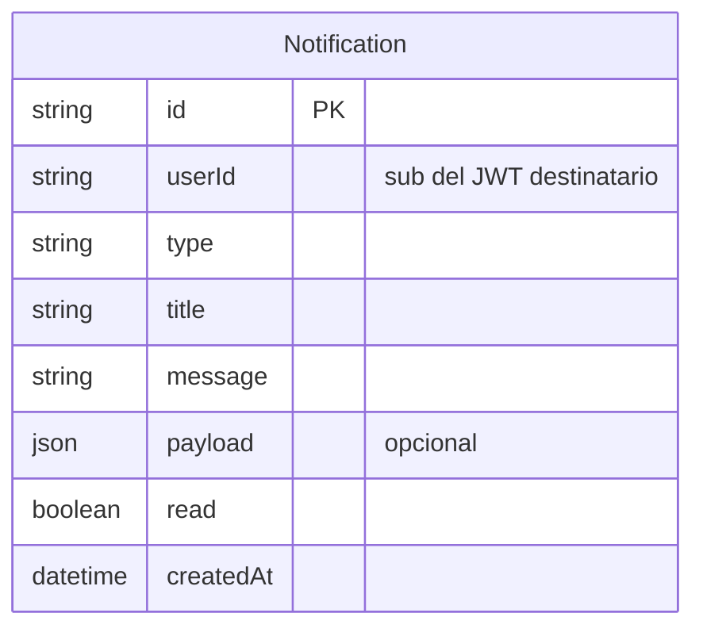
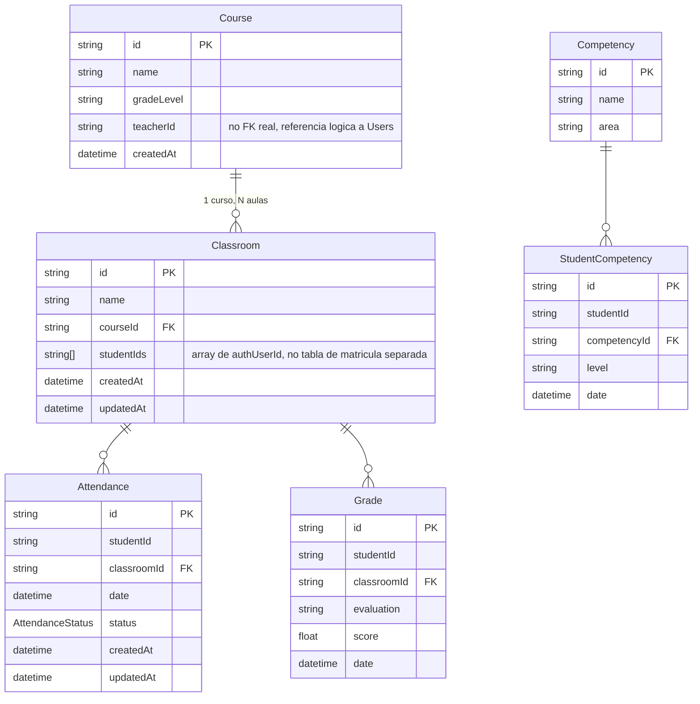
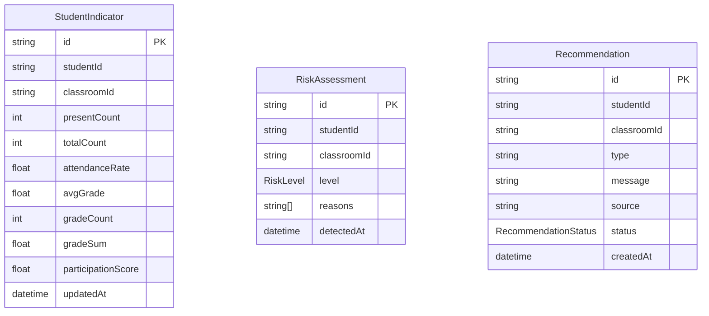
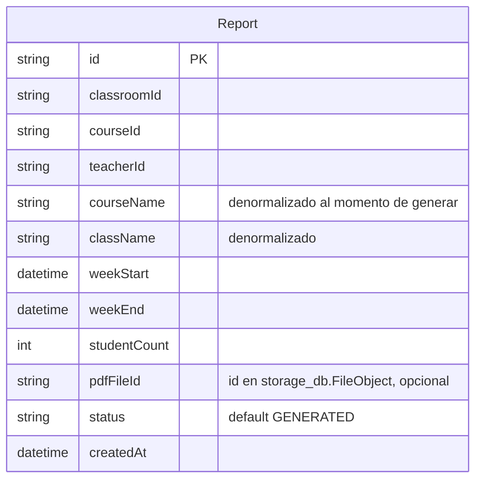
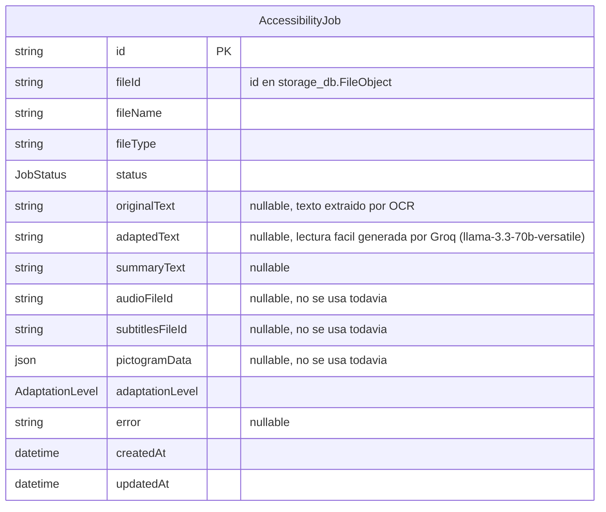
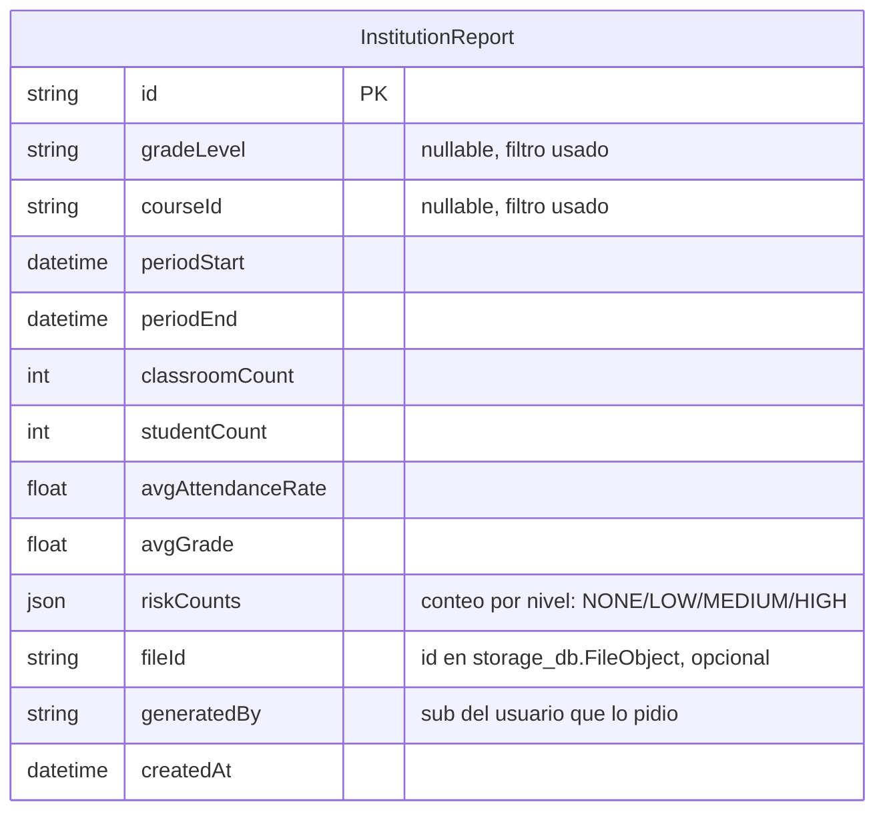

# Bases de datos

Un Postgres compartido (`docker-compose.yml`, contenedor `postgres`) con **9 bases de datos separadas**, una por servicio (creadas por `docker/postgres/init-multiple-dbs.sh` a partir de `POSTGRES_MULTIPLE_DATABASES`). Gateway no tiene DB. **No hay foreign keys entre bases** — cualquier referencia a datos de otro servicio (ej. `authUserId`, `classroomId`, `teacherId`) es un string suelto, sin integridad referencial a nivel de Postgres; la consistencia se mantiene por convención de la aplicación (HTTP interno / eventos).

Todos los `schema.prisma` declaran `output = "../generated/prisma"` (carpeta gitignored, se regenera con `pnpm --filter <servicio> exec prisma generate`) y el cliente se importa por ruta relativa (`../../generated/prisma`), nunca desde `@prisma/client`.

## `auth_db` — Auth

`Role` = `ADMIN | DIRECTIVO | DOCENTE | ESPECIALISTA | ESTUDIANTE` (mismo enum duplicado en cada schema que lo necesita — Prisma no comparte enums entre datasources).

Solo credenciales. `AuthUser.id` es el mismo valor que `sub` en el JWT y que `User.authUserId` en `users_db`.

## `users_db` — Users

Perfil separado de las credenciales. `role` está duplicado aquí respecto a `auth_db` (por diseño, para no depender de una llamada síncrona a Auth en cada lectura) — si un rol cambia, hay que actualizarlo en ambos lados (no hay un mecanismo de sincronización automática hoy).

## `storage_db` — Storage

## `notifications_db` — Notifications

## `classroom_db` — Classroom (6 modelos, el esquema más grande)

Notas de diseño:

- **La matrícula (`studentIds`) es un array de strings dentro de `Classroom`**, no una tabla de junction `Enrollment` — matricular/desmatricular es un `push`/`pull` sobre ese array (`ClassroomController.enroll/unenroll`). Simple para el alcance del hackathon, pero significa que no hay historial de matrícula ni fecha de ingreso por estudiante.
- `AttendanceStatus` = `PRESENT | ABSENT | LATE | EXCUSED`. `Attendance` tiene `@@unique([studentId, classroomId, date])` — un estudiante no puede tener dos registros de asistencia el mismo día en la misma aula (el `POST /attendance` batch hace upsert implícito por esta constraint).
- `Grade.classroomId` tiene `onDelete: Cascade` desde `Classroom`; `Attendance.classroomId` también. Si se borra un aula, se borran sus asistencias y notas.
- `teacherId` en `Course` no es una foreign key real — es el `authUserId` del docente, validado solo a nivel de aplicación (no de Postgres).

## `analytics_db` — Analytics (3 modelos)

`StudentIndicator` tiene `@@unique([studentId, classroomId])` — es un **acumulador que se actualiza in-place** cada vez que llega un evento de asistencia/nota (no una serie histórica; `gradeSum`/`gradeCount` existen justamente para poder recalcular el promedio incrementalmente sin releer todas las notas). `RiskLevel` = `NONE | LOW | MEDIUM | HIGH`. `RecommendationStatus` = `PENDING | SENT | DISMISSED`.

Ninguno de los tres modelos tiene relación Prisma declarada hacia Classroom (no puede — es otra base de datos); `studentId`/`classroomId` son strings sueltos que solo tienen sentido cruzados con `classroom_db` a nivel de aplicación.

## `ai_db` — AI

Reporte semanal **de una sola aula**. Los campos `courseName`/`className` están desnormalizados a propósito (copiados de Classroom al momento de generar) para que el reporte no cambie retroactivamente si el nombre del curso/aula cambia después.

## `accessibility_db` — Accessibility

`JobStatus` = `PENDING | PROCESSING | COMPLETED | FAILED`. `AdaptationLevel` = `LEVE | MODERADO | SIGNIFICATIVO`. Nota: `audioFileId`, `subtitlesFileId` y `pictogramData` están en el schema pero **el pipeline actual no los llena** (el audio se devuelve directo en la response de `POST /process/audio`, no se persiste en Storage todavía) — quedaron como campos preparados para una extensión futura.

## `reports_db` — Reports

Reporte agregado **multi-aula**. No hay un modelo `scope`/enum explícito: si `gradeLevel` y `courseId` son ambos `null`, el reporte es institucional completo; si alguno está seteado, fue filtrado por ese criterio. `riskCounts` es la única columna `Json`/`JSONB` de todo el sistema (el resto de conteos agregados son columnas numéricas planas).

## Resumen: qué servicio es dueño de qué dato

| Dato | Dueño (fuente de verdad) | Quién más lo lee/copia |
|---|---|---|
| Credenciales (email, password) | Auth | — |
| Perfil (nombre, rol) | Users | Auth guarda una copia de `role` al registrar |
| Archivos binarios | Storage | AI, Reports, Accessibility (suben/leen vía interno) |
| Notificaciones | Notifications | — |
| Cursos, aulas, matrícula, asistencia, notas, competencias | Classroom | Analytics (vía eventos), AI y Reports (vía HTTP interno, solo lectura) |
| Indicadores, riesgo, recomendaciones | Analytics | AI y Reports (vía HTTP interno, solo lectura) |
| Reportes PDF por aula | AI | — |
| Reportes CSV institucionales | Reports | — |
| Jobs de accesibilidad | Accessibility | — |

Ningún servicio escribe en la base de datos de otro directamente — toda escritura cruzada pasa por un endpoint HTTP (`/internal/*` o público) del servicio dueño.
